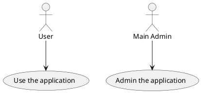
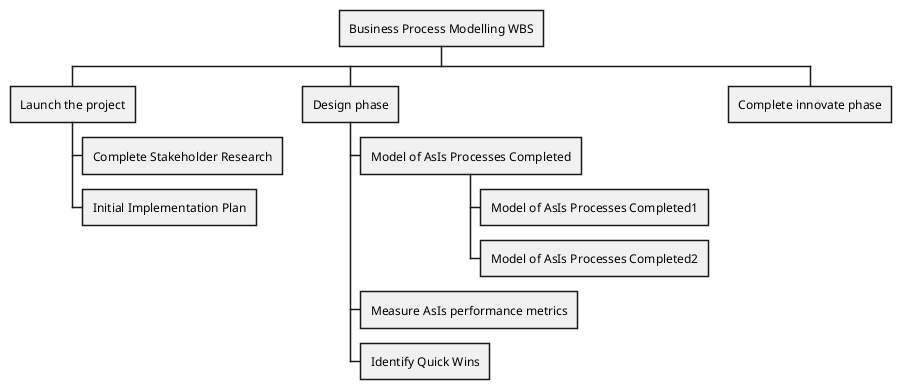

# Project Basis
- Create installation script in the parent directory (A script that - installs the other scripts in the system)
- Review all the scripts in the directory `in_review` and make them production ready (from a functional perspective) and move them to the `customize` directory
- Review this file and ensure the TODOs are actual
- Test with a docker Ubuntu image
  - Create a docker Ubuntu container for testing
  - Document how to start the container and how to test the project
- copy/paste inside the _new_structure_directory each script on its respective folder
- get the content of the _new_structure_ directory and put it in the root directory
- create a .gitignore
- Create a proper README.md file
- Branching strategy
- Bash Script templates:
    - Parse arguments
    - Interpolate some fields during installation:
      - Author name
      - Email
      - Company name
- Python Script templates:
    - Documentation
    - Parse arguments
    - Interpolate some fields during installation:
      - Author name
      - Email
- Complete the TODOs for each script
- Create man pages for the scripts
  - https://unix.stackexchange.com/questions/34516/can-i-create-a-man-page-for-a-script
  - https://www.cyberciti.biz/faq/linux-unix-creating-a-manpage/

# Scripts TODOs

## Java
  ### install_sdkman.sh
  ### install_JDK.sh (using sdkman)
  ### install_gradle.sh (using sdkman)
  ### install_maven.sh (using sdkman)
  ### install_eclipse.sh
  ### install_intellij.sh 

## Python
  ### install_pycharm.sh

## JS
  ### install_NVM.sh
  ### install_NodeJS
  ### install_Postman.sh ???
  ### install_Newman.sh
  ### install_Postman_Collection_Transformer.sh
  ### install_visual_studio_code.sh

## DEVOPS
  ### install_docker.sh (See mdwiki & existing script)
  ### docker_no_sudo.sh (See mdwiki)
  ### install_docker-compose.sh (See mdwiki)
  ### install_kubectl.sh (See mdwiki)
  ### install_minikube.sh (See mdwiki)
  ### install_helm.sh (See mdwiki)
  ### install_azure.sh
  

## install_java.sh

- separate repository ???
- man documentation
- Header
- parse arguments & show error
- include external references ???
- create functions 
- clean obsolete code
- redo the article InstallOpenJDKInUbuntu.md

## mute_ms_teams.sh

- man documentation
- Header
- 

## create_directory_structure.sh

## linux_setup.sh

## ubuntu_setup.sh

# TODOs for the future

 - https://stackoverflow.com/questions/59895/how-to-get-the-source-directory-of-a-bash-script-from-within-the-script-itself
 - https://stackoverflow.com/questions/1371261/get-current-directory-name-without-full-path-in-a-bash-script
 - https://stackoverflow.com/questions/6482377/check-existence-of-input-argument-in-a-bash-shell-script

 # Enrich the documentation with plantuml diagrams

Below you have some examples:

Source:
 - [Diagrams with plantuml](https://blog.anoff.io/2018-07-31-diagrams-with-plantuml/)

# Ideas for future scripts

## Script for checking sha256 on right click
Script that creates a new entry on the right click menu when a single file is selected and shows a menu called "Checksum" and from here a set of options are displayed such as "sha256", "md5", etc ... When the user selects one of this options (i.e. sha256) a popup textbox is displayed where the user can copy/paste the checksum to be checked.

## Joint PDFs on right click
Script that creates a new entry on the right click menu when 2 or more PDF files are selected and merge. If the user selects the option "Merge PDFs" the action will result in a new PDF document that contains all the other PDF documents merged by the sorting name in the OS (Check what is the sorting criteria for filenames in Linux). If there are files selected that are not PDF files (i.e 3 PDF files plus a JPG file, the non PDF files will be ignored).

